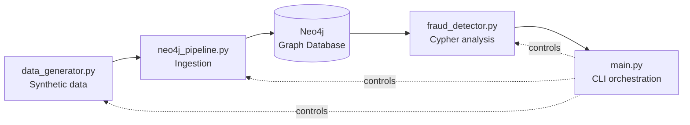

# Architecture

This document describes the internal structure of **fraud-detection-neo4j** and
the reasoning behind its main design decisions.

For the graph schema itself (node labels, relationships, constraints), see
[`DATA_MODEL.md`](./DATA_MODEL.md).

## 1. Overview

The project is split into four independent modules, each with a single
responsibility. There is no framework holding them together — they are plain
Python classes/functions composed explicitly in `main.py`. This was a deliberate
choice: at this project's scale, an explicit composition root is easier to read
and debug than implicit wiring.

| Module | Responsibility | Key design choice |
|---|---|---|
| `data_generator.py` | Generates a synthetic dataset of clients, bank accounts and transactions, including deliberately injected fraud cycles | Immutable (`frozen=True`) dataclasses; seeded RNG for reproducibility |
| `neo4j_pipeline.py` | Loads the dataset into Neo4j: schema setup and batched ingestion | Idempotent schema (`IF NOT EXISTS`); `UNWIND + MERGE` batch writes |
| `fraud_detector.py` | Runs Cypher queries that surface suspicious patterns in the graph | Each detection strategy is an isolated, independently testable query |
| `main.py` | CLI entry point; wires the three modules together based on flags | Configuration via `.env`, with validated fallbacks |

## 2. Data Flow

1. **Generation** — `SyntheticDataGenerator` produces a base population of
   clients and accounts, injects normal transactions at random, then injects
   `num_fraud_cycles` closed transaction loops — see
   [`METHODOLOGY.md`](./METHODOLOGY.md) for exactly how and why this models
   real laundering behavior.
2. **Ingestion** — `Neo4jPipeline` first calls `setup_schema()`, which creates
   uniqueness constraints and indexes *if they don't already exist* (full
   definitions in [`DATA_MODEL.md`](./DATA_MODEL.md)). It then ingests clients,
   accounts and transactions in batches of `BATCH_SIZE` (500) using
   `UNWIND + MERGE`, which sends one network round-trip per batch instead of
   one per row.
3. **Detection** — `FraudDetector` runs four Cypher queries against the
   populated graph (full text and explanation in
   [`CYPHER_QUERIES.md`](./CYPHER_QUERIES.md)) and returns structured, ranked
   results.
4. **Orchestration** — `main.py` parses CLI flags, loads `.env` configuration,
   and calls the three steps above in order. Flags like `--skip-ingest` allow
   re-running detection against an already-populated database without
   regenerating data from scratch.

## 3. Key Design Decisions

**Idempotent schema setup.** Constraints and indexes are created with
`IF NOT EXISTS`. Running `setup_schema()` twice against the same database is
safe and produces no errors — a property that matters the moment this script
is run more than once during development, or as part of any future automated
pipeline.

**Batched ingestion, not row-by-row.** `UNWIND + MERGE` is Neo4j's recommended
pattern for bulk writes: a single Cypher statement processes an entire batch in
one transaction, instead of issuing one network round-trip per row. At this
project's data volume the difference is invisible; the pattern is used anyway
because it's the one that doesn't fall over once the volume grows.

**Specific exception handling, not generic `except Exception`.**
`Neo4jPipeline.connect()` distinguishes `ServiceUnavailable` (the database isn't
running) from `AuthError` (the credentials are wrong) and logs a different,
actionable message for each. A generic catch-all would tell the user
"something failed" without telling them which of the two very different
problems they actually have.

**Connection lifecycle via context manager.** Both `Neo4jPipeline` and
`FraudDetector` implement `__enter__`/`__exit__`, so the driver connection is
guaranteed to close even if an exception is raised mid-operation — there's no
code path that leaks an open connection.

**Transactions modeled as nodes, not edges.** This is explained in detail in
[`DATA_MODEL.md`](./DATA_MODEL.md#why-transactions-are-nodes), but the short
version: a transaction carries its own properties (`amount`, `timestamp`,
`label`, `cycle_id`) that need independent indexing — modeling it as a
relationship would make those properties harder to query in Cypher.

## 4. Known Limitations

This section exists because a project that hides its limitations is less
trustworthy than one that names them.

- The dataset is synthetic. No real (or realistically anonymized) transaction
  data is used.
- The project targets a single local Neo4j instance; it has not been tested
  against a clustered or AuraDB Enterprise deployment.
- There is currently no automated test suite.
- Fraud detection here is **rule-based** (explicit Cypher patterns), not
  statistical or ML-based. That is a deliberate scope choice for this project,
  not an oversight — but it is worth stating plainly.
- Q2's `initial_amount`/`final_amount` (and therefore the derived "fee") are
  computed from whichever rotation of a cycle Cypher happens to return, not
  from the cycle's true chronological start — see
  [`CYPHER_QUERIES.md`](./CYPHER_QUERIES.md#q2--structural-cycles-label-independent)
  for why. Q1's figures, based on the `cycle_id` label, are not affected.

## 5. Related Documents

- [`DATA_MODEL.md`](./DATA_MODEL.md) — graph schema: node labels,
  relationships, constraints and indexes.
- [`CYPHER_QUERIES.md`](./CYPHER_QUERIES.md) — full text and explanation of
  every detection query.
- [`METHODOLOGY.md`](./METHODOLOGY.md) — how the synthetic fraud patterns were
  designed and why they are representative of real laundering schemes.