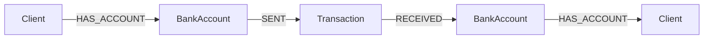

# Data Model

Financial transactions are naturally a **graph problem**, not a tabular one: a
laundering cycle is, by definition, a *path* — money moving from account A to B
to C and back to A. Representing this in a relational database means modeling
relationships as foreign keys and reconstructing the cycle through repeated
self-joins, one per hop. The query grows linearly with cycle length, and the
intent ("is there a path that returns to its origin?") gets buried in JOIN
logic. In a graph, that same question is a structural property of the model.

## Graph Overview



## Node Labels

### `Client`
| Property | Type | Notes |
|---|---|---|
| `client_id` | `string` | Unique (constraint enforced) |
| `name` | `string` | |
| `cpf` | `string` | Synthetic, generated via Faker (`pt_BR` locale) |
| `email` | `string` | |

### `BankAccount`
| Property | Type | Notes |
|---|---|---|
| `account_id` | `string` | Unique (constraint enforced) |
| `account_number` | `string` | |
| `balance` | `float` | |
| `bank_name` | `string` | One of 7 major Brazilian banks, randomly assigned |

### `Transaction`
| Property | Type | Notes |
|---|---|---|
| `tx_id` | `string` | Unique (constraint enforced) |
| `amount` | `float` | |
| `timestamp` | `datetime` | |
| `label` | `string` | `"NORMAL"` or `"FRAUDE_CICLO"` |
| `cycle_id` | `string \| null` | Set only for transactions belonging to an injected fraud cycle; indexed |

## Relationship Types

| Relationship | Direction | Meaning |
|---|---|---|
| `HAS_ACCOUNT` | `Client → BankAccount` | Ownership |
| `SENT` | `BankAccount → Transaction` | The transaction originated from this account |
| `RECEIVED` | `Transaction → BankAccount` | The transaction landed in this account |

## Why Transactions Are Nodes

Transactions are modeled as **nodes**, not as a relationship directly between
two accounts. This is intentional: a transaction has its own properties
(`amount`, `timestamp`, `label`, `cycle_id`) that need to be queried and indexed
independently of the accounts involved — for example, `Q3` in
[`CYPHER_QUERIES.md`](./CYPHER_QUERIES.md) filters transactions by `label`
directly, and `Q1` groups them by `cycle_id`. Modeling a transaction as an edge
would force those properties onto a relationship, which Cypher can index, but
far less ergonomically than a labeled node — and it would make `Transaction` a
second-class citizen in a model where it's actually the central object being
analyzed.

## Constraints and Indexes

Created by `Neo4jPipeline.setup_schema()`, all with `IF NOT EXISTS` (safe to
run repeatedly):

```cypher
CREATE CONSTRAINT client_id_unique IF NOT EXISTS
FOR (c:Client) REQUIRE c.client_id IS UNIQUE;

CREATE CONSTRAINT account_id_unique IF NOT EXISTS
FOR (a:BankAccount) REQUIRE a.account_id IS UNIQUE;

CREATE CONSTRAINT tx_id_unique IF NOT EXISTS
FOR (t:Transaction) REQUIRE t.tx_id IS UNIQUE;

CREATE INDEX tx_label_idx IF NOT EXISTS
FOR (t:Transaction) ON (t.label);

CREATE INDEX tx_cycle_idx IF NOT EXISTS
FOR (t:Transaction) ON (t.cycle_id);
```

The two indexes on `Transaction` exist because both `label` and `cycle_id` are
filter/group-by targets in every detection query in `CYPHER_QUERIES.md` —
without them, each query would force a full label scan over every
`Transaction` node in the graph.